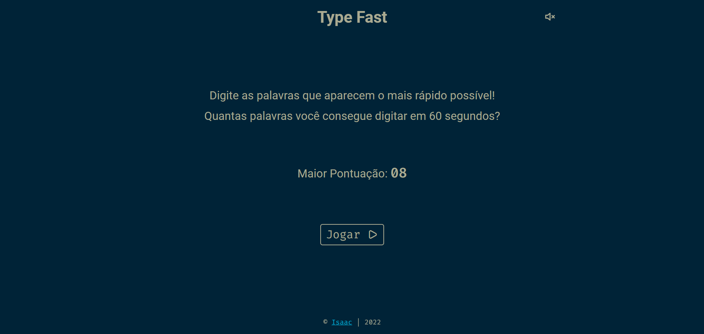
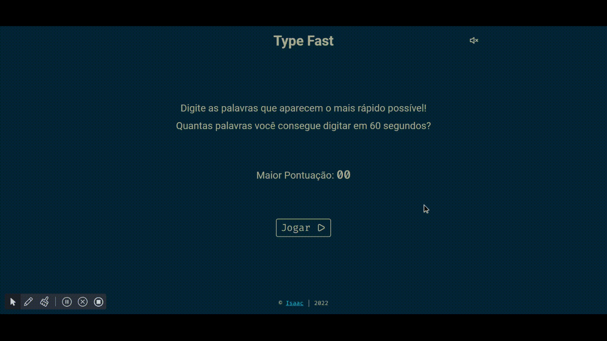

#  TypeFast 




---

## 🤔 About

**TypeFast** is a simple typing game. The objective is to correctly type each word that appears on the screen as quickly as possible before the 60 second time runs out.

<br>

To play, just access the link: [Play TypeFast](https://eoisaac.github.io/Type_Fast/)




## 📁 Installation

To install it is very simple, just use the following command:

```
git clone https://github.com/eoisaac/Type_Fast.git
```

## 🔧 Technologies

This project was made using the following technologies:
- JavaScript
- HTML
- CSS

## 👨‍💻 Author


[Isaac Santiago](https://github.com/eoisaac)

## 📝 License

This project has a license, you can access the file to see more details [](LICENSE.md)

---

[⬆ Back to top](#TypeFast)